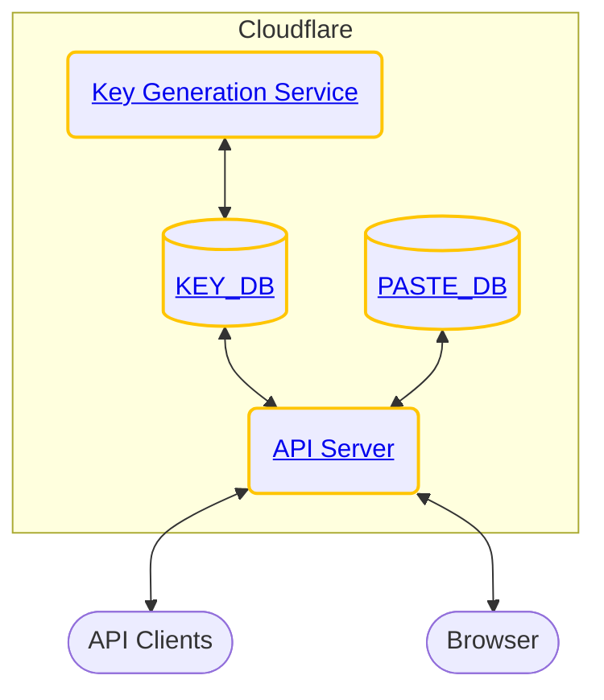

<h1 align="center"><strong>Paste Story</strong></h1>

> **NOTE**
> This project uses `wrangler@v1.x.x`. `wrangler@v2.x.x` was released 1st May 2022, check out the comparison [here](https://developers.cloudflare.com/workers/wrangler/compare-v1-v2/).



Paste Story is a [Pastebin](https://pastebin.com/) clone — a web service that allows users to share text content through a link known as 'pastes'.

“Why Pastebin?” you might ask. Well, sending 50 lines long block of text through a chat app isn’t exactly the best way to communicate.

[Read more...](https://jerrynsh.com/how-to-build-a-pastebin-clone-for-free/)

## Table of Contents

- [Table of Contents](#table-of-contents)
- [Requirements](#requirements)
- [Setup](#setup)
  - [Installation](#installation)
  - [Usage & Deployment](#usage--deployment)
  - [Creating KV](#creating-kv)
- [Optional: CI/CD](#optional-cicd)
- [Contributing](#contributing)
  - [Steps](#steps)

## Requirements

-   Get a [Cloudflare](https://www.cloudflare.com/) account
-   Install [Wrangler](https://github.com/cloudflare/wrangler#installation) CLI for Cloudflare Workers deployment

## Setup

Check out Steps 1 to 3 of this [Get Started Guide](https://developers.cloudflare.com/workers/get-started/guide) to setup a Cloudflare account.

### Installation

Run `make install`.

### Usage & Deployment

Check out the following:

-   `server/`'s [README.md](./server/README.md)
-   `kgs/`'s [README.md](./kgs/README.md)

### Creating KV

Since we're using KV as our storage, we need to first create it.

```sh
# Production namespace:
wrangler kv:namespace create "PASTE_DB"
wrangler kv:namespace create "KEY_DB"

# This namespace is used for `wrangler dev` local testing:
wrangler kv:namespace create "PASTE_DB" --preview
wrangler kv:namespace create "KEY_DB" --preview
```

For creating these KV namespaces, remember to update your `wrangler.toml` files of the respective service to include the namespace bindings accordingly.

## Optional: CI/CD

1. This project uses [Wrangler actions](https://github.com/marketplace/actions/deploy-to-cloudflare-workers-with-wrangler) to automatically publish worker. To do so, add `CF_API_TOKEN` into your GitHub repository secrets. You can [create your API token](https://dash.cloudflare.com/profile/api-tokens) using the `Edit Cloudflare Workers` template.

2. This project also uses [semantic-release](https://github.com/semantic-release/npm) to automatically publish to NPM. To enable this, you will need to create a `NPM_TOKEN` via [npm create token](https://docs.npmjs.com/getting-started/working_with_tokens#how-to-create-new-tokens) and add it to your GitHub repository secrets.

## Contributing

Pull requests are welcome. For major changes, please open an issue first to discuss what you would like to change.

### Steps

1. Fork this
2. Create your feature branch (`git checkout -b tom/fooBar`)
3. Code
4. Commit your changes (`git commit -am 'feat: add some fooBar'`, make sure that your commits are [semantic](https://gist.github.com/joshbuchea/6f47e86d2510bce28f8e7f42ae84c716))
5. Push to the branch (`git push origin tom/fooBar`)
6. Create a new Pull Request
